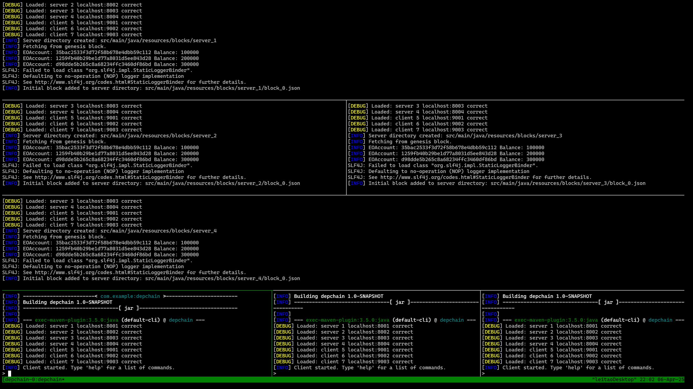

# DepChain - Highly Dependable Systems (2024-2025)

## Overview

DepChain is a simplified permissioned blockchain system with high dependability guarantees. This project is developed iteratively in two stages:

- **Stage 1**: Focuses on the consensus layer, specifically implementing a version of the Byzantine Read/Write Epoch Consensus algorithm.
- **Stage 2**: Targets the transaction processing layer.

## Features

- Static system membership with a pre-defined leader.
- Use of Public Key Infrastructure (PKI) for secure identity verification.
- Implementation of the Byzantine Read/Write Epoch Consensus algorithm.
- Support for Byzantine behavior among blockchain members.
- UDP-based network communication with custom abstraction layers.
- Client interface for submitting transactions (string appends).

## Project Structure

```
DepChain/
│── src/                        
│   ├── main/
|   |   ├── java/
│   |   |   ├── depchain/
│   |   |   |   ├── blockchain/     # Blockchain member implementation
│   |   |   |   ├── client/         # Client CLI for submitting transactions
│   |   |   |   ├── consensus/      # Byzantine Read/Write Epoch Consensus implementation
│   |   |   |   ├── library/        # Client library for submitting transactions
│   |   |   |   ├── network/        # UDP-based communication and message handling
│   |   |   |   ├── utils/          # Utility classes and helper functions
|   |   |   ├── resources/
|   |   |   |   ├── config/         # Configuration files for testing
|   |   |   |   |   ├── byzantineStateConfig.json
|   |   |   |   |   ├── correctConfig.json
|   |   |   |   |   ├── ignoreMessagesConfig.json
|   |   |   |   |   ├── impersonateConfig.json
|   |   |   |   |   ├── spamConfig.json
|   |   |   |   ├── keys/           # Cryptographic keys
│   ├── test/
│   |   ├──  java/
│   |   |   ├── depchain/
│   |   |   |    ├── ClientServerCorrectCommunicationTest/  # Append test
│── README.md                   # Project description and usage guide
```

## Installation and Setup

### Prerequisites

- Java Development Kit (JDK) 17+
- Maven

### Build and Run

To build the project:

```sh
mvn clean install
```

To run the system:

```sh
mvn exec:java -Dexec.mainClass="<CLASS>"
```

Replace `<CLASS>` with the desired main class, e.g., `depchain.client.DepChainClient`.

If you need to pass arguments to the main class, use the `-Dexec.args` parameter:

```sh
mvn exec:java -Dexec.mainClass="<CLASS>" -Dexec.args="arg1 arg2"
```

To run the server:

```sh
mvn exec:java -Dexec.mainClass="depchain.blockchain.BlockchainMember" -Dexec.args="1 8001"
```

To run the client:

```sh
mvn exec:java -Dexec.mainClass="depchain.client.DepChainClient" -Dexec.args="5 9001"
```

### Configuration

Environment variables can be set in the `.env` file located in the root directory. The following variables are available:

- `CONFIG_FILE_PATH`: Path to the configuration file.
- `KEYS_FOLDER_PATH`: Path to the folder containing cryptographic keys.
- `DEBUG`: Enable/disable debug mode.

### Formatting

To format the code according to the project's style guide:

```sh
mvn formatter:format
```

## Testing

To run unit and integration tests:

```sh
mvn test
```

The test suite includes:

- Functional correctness tests for the consensus algorithm.
- Network reliability tests.
- Byzantine behavior simulations.

### Usage

You can run each behavior test individually by changing the `CONFIG_FILE_PATH` environment variable in the `.env` file for the desired configuration file located in the `src/main/java/resources/config/` directory.

Afterwards, run the test script:

```sh
python3 test.py
```

NOTE: you might need to first install `tmux`:

```sh
sudo apt install tmux -y
```

Then you can interact with the blockchain as a client:



## Design Considerations

- **Safety & Liveness**: The system ensures safety under all conditions and guarantees liveness only if the leader remains correct.
- **Client-Consensus Integration**: The client submits requests that are transformed into consensus proposals.
- **Security**: Cryptographic operations ensure message authentication and integrity.

## Future Work (Stage 2)

- Implementing leader election and dynamic membership.
- Expanding transaction processing capabilities.
- Enhancing fault tolerance and security measures.

## Contributors

- Guilherme Leitão - ist199951
- Simão Sanguinho - ist1102082
- José Pereira - ist1103252

Group 12 - 2024/2025

Project developed for the Highly Dependable Systems course at Instituto Superior Técnico, University of Lisbon.

## References

[1] Introduction to Reliable and Secure Distributed Programming. 2nd Edition.
[2] Springer Computer Science Proceedings Guidelines: https://www.springer.com/gp/computer-science/lncs/conference-proceedings-guidelines
